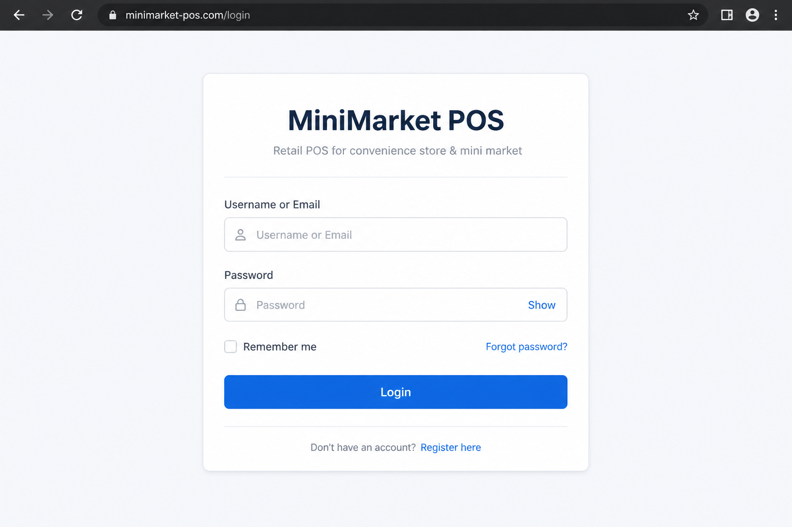
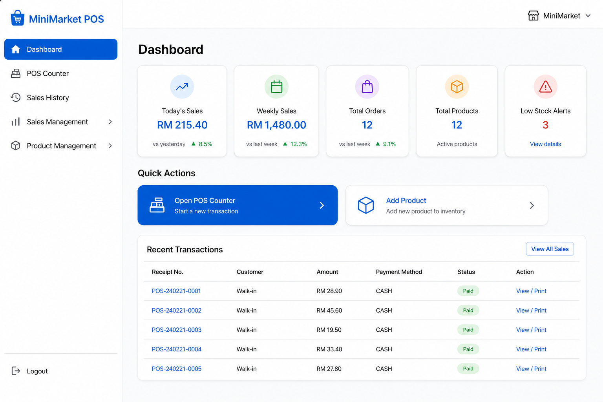
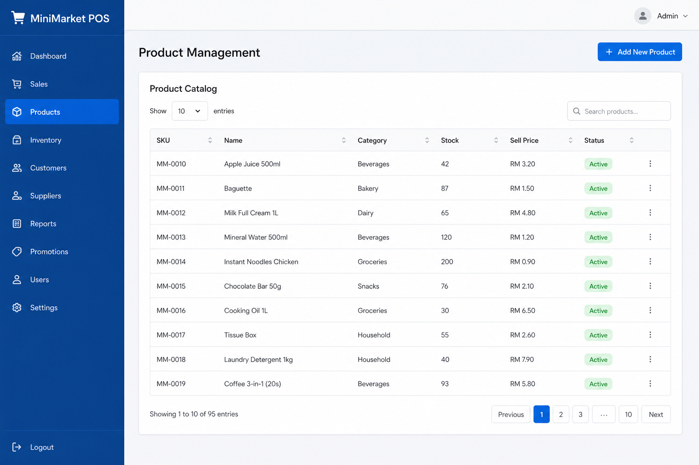
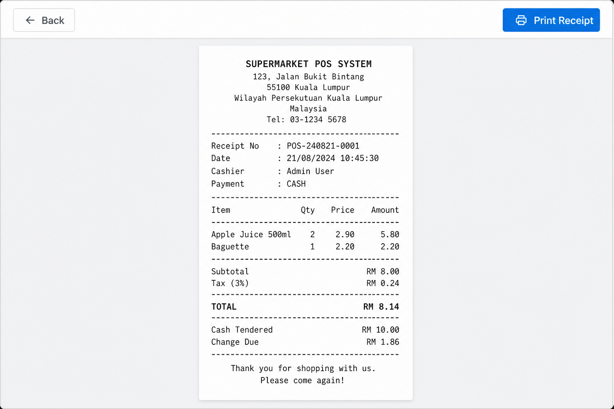

# MiniMarket POS

Retail point-of-sale system for Malaysian mini markets and convenience stores.


## Screenshots

| Login | Dashboard |
| --- | --- |
|  |  |

| Product Management | Receipt |
| --- | --- |
|  |  |

More images: [`docs/screenshots`](docs/screenshots)

## Features

- Admin and cashier roles
- POS counter with barcode/SKU search, cart, and payment
- Add products, users, customers, and suppliers
- Saved receipts with browser print
- Inventory and sales history
- RM currency and Malaysian payment methods (Cash, Card, DuitNow, TNG, Grab, Boost)

## Stack

- PHP 8+
- Apache (XAMPP)
- HTML / CSS / JavaScript
- JSON file storage in `data/` (MySQL schema included for later use)

## Installation

1. Clone this repo into your web root, for example `C:\xampp\htdocs\pos`.
2. Default demo login:
   - Admin: `admin` / `admin123`
   - Cashier: `rina` / `cashier123`
3. Open `http://localhost/pos/login.php`

### Optional MySQL

1. Import [`docs/database-schema.sql`](docs/database-schema.sql) in phpMyAdmin.
2. Copy [`database.example.php`](database.example.php) to `includes/database.php`.
3. Fill in your local database username and password. Do not commit `includes/database.php`.

## Project layout

```
pos/
├── api/                  Auth, checkout, print APIs
├── assets/               CSS, JS, product images
├── data/                 JSON data store
├── docs/                 Schema, screenshots, notes
├── includes/             Helpers and data store
├── database.example.php  Sample DB config (copy, don't commit secrets)
├── LICENSE
└── login.php
```

## License

This project is released under the [MIT License](LICENSE).
