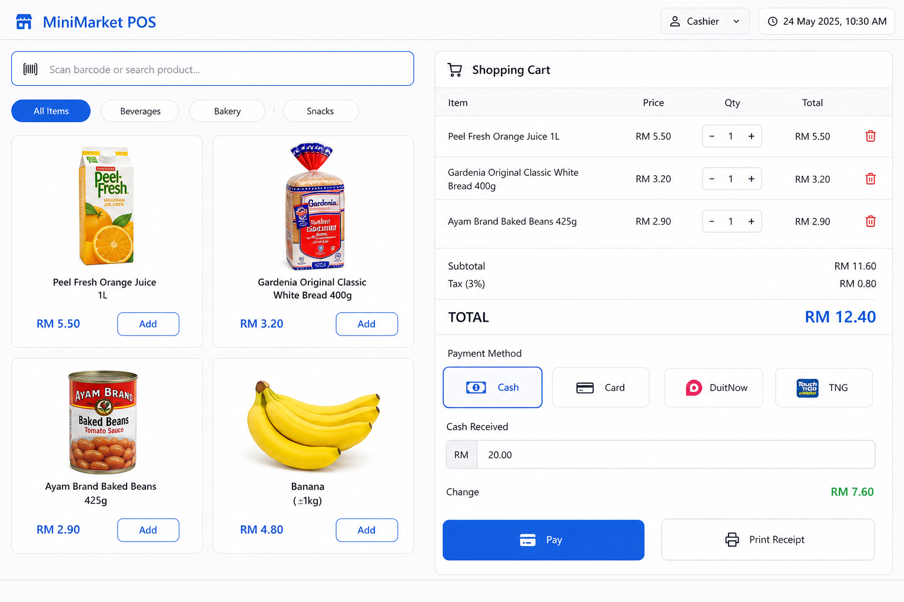

# MiniMarket POS System

This project is a modern retail point-of-sale system designed for Malaysian mini markets and convenience stores.

See the main project README: [`README.md`](../README.md)

## Screenshots

Preview images live in [`docs/screenshots`](screenshots).

## Features

- Administrator and cashier roles with role-based access control.
- Dashboard with sales stats, low stock alerts, and recent transactions.
- POS counter with barcode/QR search, customer selection, payment processing, and receipt printing.
- Product management with images, categories, and supplier links.
- Inventory management and stock tracking.
- Customer and supplier management.
- Reporting for sales, products, and inventory.
- Responsive interface with tablet/touchscreen-friendly UI.
- Designed for RM currency and Malaysian retail workflows.

## Recommended Stack

- PHP 8+ with MySQL/MariaDB (optional)
- Apache or Nginx (XAMPP)
- HTML/CSS/JavaScript frontend

## Installation

1. Place the `pos` folder under your web root.
2. Open `login.php` in your browser.
3. Demo accounts: `admin` / `admin123` and `rina` / `cashier123`.

### Optional MySQL

1. Create the database and tables using `docs/database-schema.sql`.
2. Copy `database.example.php` to `includes/database.php` and update connection details.

## License

MIT — see [`LICENSE`](../LICENSE).
